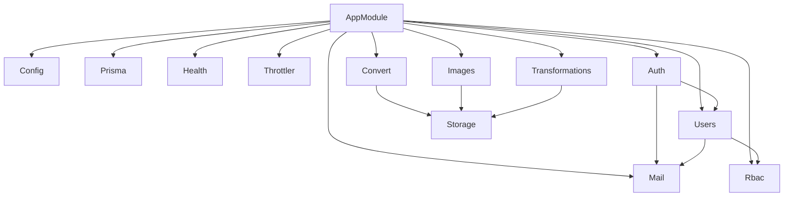
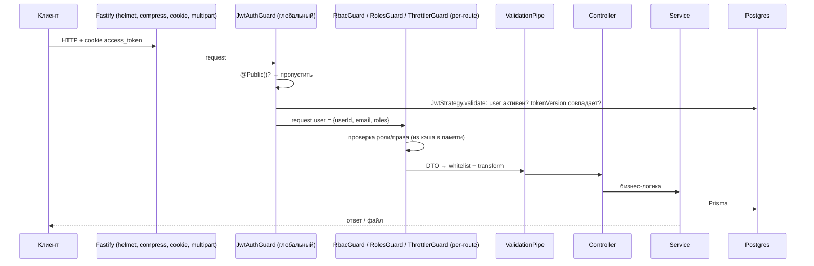
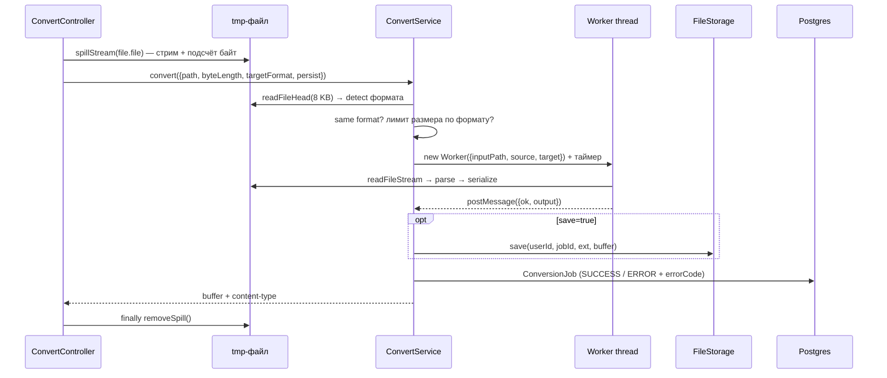
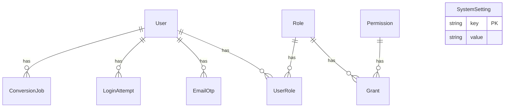

# Архитектура приложения

Документ описывает, из чего состоит бэкенд, как проходят запросы через систему и почему решения приняты именно так. Подробности конкретных модулей — в их README (`src/core/config/README.MD`, `src/core/health/README.MD`, `src/modules/convert/README.md`).

---

## 1. Что это за проект

NestJS-монолит, который даёт:

- **аутентификацию** (регистрация/логин с подтверждением по email-коду, JWT в HttpOnly-cookies);
- **управление пользователями** (профиль, аватар, смена email, удаление аккаунта);
- **RBAC** — собственная система ролей и прав с админским CRUD;
- **конвертацию данных** CSV ⇄ JSON ⇄ XML ⇄ YAML;
- **конвертацию изображений** PNG → JPEG, JPEG → PNG, SVG → PNG/JPEG;
- **историю преобразований** с возможностью сохранить результат и скачать его позже, с автоочисткой по сроку хранения.

Стек:

| Слой | Технология | Почему |
|---|---|---|
| HTTP | Fastify (`@nestjs/platform-fastify`) | Быстрее Express, нативная работа со стримами, плагины для multipart/cookie/static/helmet |
| DI / модули | NestJS 11 | Явные границы модулей, guards, pipes, lifecycle-хуки (`onModuleInit`) |
| БД | PostgreSQL + Prisma 7 (`@prisma/adapter-pg`) | Типизированный клиент, миграции, один инструмент на схему и миграции |
| Валидация | `class-validator` + глобальный `ValidationPipe` | Единый способ валидировать DTO и env |
| Пароли/OTP | `argon2` | Современный медленный хэш, устойчив к перебору |
| Картинки | `sharp` (libvips) | Быстрый нативный процессинг, растеризация SVG |
| Данные | `csv-parse`/`csv-stringify`, `fast-xml-parser`, `yaml` | Зрелые парсеры для каждого формата |
| Почта | `nodemailer` | SMTP-отправка OTP-кодов |

---

## 2. Почему монолит

Это **модульный монолит**: один процесс, одна БД, один деплой — но код разделён на независимые Nest-модули с явными зависимостями.

Для проекта такого размера это правильный выбор:

- **Нет распределённых проблем.** Не нужны брокер сообщений, service discovery, распределённые транзакции, трассировка между сервисами. Запись `ConversionJob` и проверка пользователя — это один запрос к одной БД.
- **Простой локальный запуск.** `docker compose up -d` (только Postgres) + `npm run start:dev`.
- **Границы уже проведены там, где их можно будет разрезать.** Если какой-то кусок придётся вынести, швы готовы:
  - `FileStorage` — абстракция хранилища (локальный диск сегодня → S3 завтра);
  - граница worker-потока в convert/images — чистая функция «вход → выход», которую легко переселить в отдельный сервис или очередь задач;
  - `CodecRegistry` — форматы подключаются как плагины.

Тяжёлая CPU-работа, которая обычно является причиной выносить что-то в отдельный сервис, здесь изолирована через **worker threads** (см. раздел 6), поэтому монолит не страдает от неё.

---

## 3. Структура кода

```
src/
├── main.ts                    # bootstrap: Fastify + плагины + глобальный ValidationPipe
├── common/
│   ├── decorators/public.decorator.ts   # @Public() — снять глобальную JWT-проверку
│   └── spill-stream.ts        # стрим загрузки → временный файл (см. раздел 7)
├── core/                      # инфраструктура, без бизнес-логики
│   ├── app/                   # AppModule — корень, собирает всё + глобальный JwtAuthGuard
│   ├── config/                # типизированный доступ к env + валидация на старте
│   ├── prisma/                # PrismaService (единая точка доступа к БД)
│   ├── mail/                  # MailService (nodemailer)
│   ├── health/                # /health (terminus)
│   └── throttler/             # глобальная конфигурация rate-limit
├── modules/                   # бизнес-модули
│   ├── auth/                  # регистрация, логин, refresh, logout, cookies
│   ├── users/                 # профиль, аватар, смена email, удаление, админский список
│   ├── rbac/                  # роли/права/гранты, guards, кэш прав
│   ├── convert/               # CSV/JSON/XML/YAML: кодеки, сервис, worker
│   ├── images/                # PNG/JPEG/SVG: сервис, worker, шрифты для SVG
│   ├── storage/               # FileStorage (абстракция) + LocalFileStorage
│   └── transformations/       # история конвертаций, скачивание, ретеншн
└── database/
    ├── schema.prisma
    └── migrations/
```

Правило: `core/` не знает о `modules/`. Модули зависят от `core/` и, где нужно, друг от друга через экспортируемые провайдеры (например, `convert` и `images` импортируют `StorageModule`, `auth` использует `UsersService`).

### Граф модулей



---

## 4. Жизненный цикл запроса



Что делает `main.ts` и зачем:

- **helmet** с CSP `default-src 'none'` — это чистый API, он не отдаёт HTML, поэтому браузеру запрещено вообще что-либо грузить из ответов. Плюс HSTS.
- **compress** — gzip/brotli ответов.
- **CORS** со списком origin'ов фронтов и `credentials: true` — обязательно, раз токены в cookies.
- **cookie** с `COOKIE_SECRET` — парсинг/подпись cookies.
- **static** `/uploads/` — раздача аватаров.
- **multipart** с глобальным лимитом 20 МБ на файл — верхняя граница, которая защищает от гигантских загрузок ещё до бизнес-логики (точные лимиты по форматам — в настройках, см. раздел 8).
- **ValidationPipe** `{ whitelist, transform, forbidNonWhitelisted }` — лишние поля в теле запроса = 400, а не тихое игнорирование.

---

## 5. Сервисы по модулям

### 5.1 Core

| Сервис | Ответственность |
|---|---|
| `ConfigService` | Обёртка над `@nestjs/config` с типизированным `get<K>()`. Env валидируется на старте — приложение падает сразу, если переменной нет или она некорректна (fail fast лучше, чем ошибка в рантайме на первом запросе). |
| `PrismaService` | Наследник `PrismaClient` с pg-адаптером. Подключается в `onModuleInit`, отключается в `onModuleDestroy`. Единственная точка доступа к БД. |
| `MailService` | Отправка писем через SMTP, шаблоны для OTP (регистрация, смена email, удаление). |
| `HealthService` | `/health` для балансировщика/оркестратора. |
| `ThrottlerModule` | Глобальные TTL/limit из env; конкретные эндпоинты переопределяют лимит через `@Throttle`. |

### 5.2 Auth (`modules/auth`)

**`AuthService`** — регистрация, логин, refresh, logout.
**`AuthCookiesService`** — выставление/очистка cookies.
**`JwtStrategy`** + **`JwtAuthGuard`** — проверка токена на каждом запросе.

Как устроено:

- **Два токена в HttpOnly-cookies**: `access_token` (path `/`, короткий, по умолчанию 15m) и `refresh_token` (path `/auth`, длинный). Refresh-cookie уходит **только** на `/auth/*` — на обычные API-запросы браузер её не отправляет, поверхность утечки меньше. HttpOnly — JS на фронте не может прочитать токен, XSS не украдёт сессию.
- **Отзыв токенов через `tokenVersion`.** В payload JWT лежит `tv`. `JwtStrategy.validate` сверяет его с `users.tokenVersion` в БД. Logout делает `tokenVersion++` → все выданные ранее токены (на всех устройствах) мгновенно становятся невалидными. Это цена одного запроса в БД на каждый запрос, зато JWT перестаёт быть «неотзываемым», и заодно сразу отсекаются деактивированные пользователи (`isActive`).
- **Регистрация** → создаётся пользователь без `emailVerifiedAt` + OTP на почту → `/auth/register/confirm`.
- **Логин** → проверка пароля (argon2). Если системная настройка `REQUIRE_LOGIN_EMAIL_CONFIRMATION = true`, создаётся `LoginAttempt` с хэшированным кодом и на почту уходит OTP; токены выдаются только после `/auth/login/confirm`. Иначе токены выдаются сразу.
- **OTP-коды хранятся только как argon2-хэш**, имеют срок жизни, лимит попыток (`maxAttempts`) и задержку на повторную отправку (`resendAvailableAt`).
- **Глобальный guard**: `JwtAuthGuard` зарегистрирован как `APP_GUARD` — всё закрыто по умолчанию, открытие требует явного `@Public()`. Это «secure by default»: забыть повесить guard на новый эндпоинт невозможно, можно только забыть его открыть.

### 5.3 Users (`modules/users`)

**`UsersService`** — самый большой сервис и эталон соглашений:

- **Логирование**: одна структурированная строка на исход — `actorUserId=… targetUserId=… event=… outcome=<http-status>`. Логи легко грепать и парсить.
- **Доступ = владение + RBAC**: «это моя запись» ИЛИ `canAccess(roles, 'users', 'read'|'update')`. Эта проверка в сервисе, а не в guard, потому что guard не знает, чья запись запрошена.
- **Allowlist полей** (`helpers/profile-field-policy.ts`): что можно менять себе и что — админу.
- **Чувствительные действия** (смена email, удаление аккаунта) — паттерн «initiate → код на почту → confirm».
- **Удаление = soft-delete + анонимизация**: email → `deleted.<id>@deleted.invalid`, PII очищается, роли/OTP/попытки логина удаляются, аватар стирается с диска. Строка остаётся, чтобы не ломать внешние ключи и аудит.
- **Аватары** лежат в `uploads/avatars/` с UUID-именами; перед удалением имя перепроверяется регуляркой — защита от path traversal через значение из БД.
- **Keyset-пагинация** (`helpers/user-list.ts`): курсор `{sort, order, value, id}` → `WHERE (field, id) > (…)`. В отличие от `OFFSET` не деградирует на больших таблицах и не «прыгает», если между страницами добавились строки.

### 5.4 RBAC (`modules/rbac`)

**`RbacService`** — своя система ролей:

```
User ─< UserRole >─ Role ─< Grant >─ Permission
                              └ actions: string[]  ([] = все действия)
```

- При старте (`onModuleInit`) все гранты грузятся в память: `Map<role, Map<permission, Set<action>>>`. После любой мутации ролей/прав/грантов кэш перезагружается.
- `canAccess(roles, permission, action?)` — **единственная** точка проверки прав. Работает без запроса к БД, поэтому её дёшево вызывать из сервисов.
- Два guard'а, вешаются на маршрут явно:
  - `RbacGuard` + `@RequirePermission('users', 'update')` — модель прав/действий;
  - `RolesGuard` + `@RequireRoles('admin')` — простая проверка по имени роли (все `admin/*` контроллеры).

Почему своя, а не библиотека (CASL и т.п.): модель простая, хранится в БД и редактируется админом в рантайме через `admin/rbac/*`.

### 5.5 Convert (`modules/convert`)

| Компонент | Роль |
|---|---|
| `ConvertController` | Принимает multipart, сливает файл во временный файл (`spillStream`), читает поля `targetFormat`, `save`/`persist`, отдаёт результат как attachment. Throttle 10/мин. |
| `ConvertService` | Оркестратор: определение формата, проверки, запуск worker'а, сохранение, запись `ConversionJob`, лог. |
| `CodecRegistry` + `FORMAT_CODECS` | Реестр кодеков, `detect()` — сначала по расширению, затем по содержимому. |
| `CsvCodec`, `JsonCodec`, `XmlCodec`, `YamlCodec` | Реализации `FormatCodec { sniff, parse, serialize }` через общее `CanonicalData`. |
| `convert-run.ts` | Чистая функция `runConvert(buffer, from, to)`: `parse` исходного кодека → `serialize` целевого. |
| `convert.worker.ts` | Тонкая обёртка: читает файл, вызывает `runConvert`, отправляет результат в `parentPort`. |
| `ConvertSettingsService` | Лимиты размера по формату и таймаут, хранятся в БД. |

**Почему каноническая модель.** Вместо N×(N−1) прямых конвертеров (12 пар для 4 форматов) — N кодеков, каждый умеет «в каноническую форму» и «из неё». Новый формат = 1 кодек, а не 2N конвертеров.

Поток `POST /api/convert`:



Ошибки — доменные (`ConvertError` с кодом) и маппятся в HTTP в одном месте (`mapError`): `PAYLOAD_TOO_LARGE` → 413, `UNSUPPORTED_FORMAT` → 415, `TIMEOUT` → 408, остальное → 400. **И успех, и ошибка** пишутся в `ConversionJob` — это аудит и источник для истории.

### 5.6 Images (`modules/images`)

Устроен **зеркально** convert'у (тот же контроллер → spill → сервис → worker → storage → `ConversionJob` с `kind: 'image'`), чтобы оба модуля читались одинаково.

Отличия:

- **Определение формата по magic bytes** (`sniffImage`): PNG/JPEG — по сигнатуре, SVG — по корневому `<svg` после пролога/комментариев. Расширение файлу не доверяем: только подсказка для SVG (расширяет окно чтения до 256 КБ).
- **Направления** ограничены `IMAGE_PAIRS`: `png→jpeg`, `jpeg→png`, `svg→png|jpeg`.
- **Опции**: `quality` (1–100), `width`/`height`, `background` (`#RRGGBB`, для заливки прозрачности при JPEG).
- **Защита от «бомб»**: `limitInputPixels = maxWidth × maxHeight`, проверка размеров через `metadata()` до декодирования, `animated: false`, `failOn: 'error'`.
- **Безопасность SVG** (`assertSvgSafe`): SVG — это XML с возможностью внешних ресурсов. Блокируются `DOCTYPE/ENTITY` (XXE, billion laughs), `<script>`, `on*=`-обработчики, `javascript:`, `foreignObject/iframe/embed/object`, внешние `href`/`url(...)` (SSRF, чтение локальных файлов через `file:`).
- **Шрифты** (`configure-fonts.ts`): при растеризации SVG текст рендерится через fontconfig. Чтобы результат не зависел от шрифтов, установленных на конкретной машине/в контейнере, в `assets/fonts/` положен DejaVu Sans, а модуль генерирует свой `fonts.conf` и выставляет `FONTCONFIG_FILE`. Импортируется первой строкой `image-run.ts`, т.е. срабатывает внутри worker'а до загрузки sharp.
- Дополнительно при `save=true` проверяется лимит **выходного** файла.

### 5.7 Storage (`modules/storage`)

```ts
abstract class FileStorage { save; read; remove }   // DI-токен
class LocalFileStorage extends FileStorage { ... }  // реализация
{ provide: FileStorage, useExisting: LocalFileStorage }
```

- Абстрактный класс используется как DI-токен, сервисы зависят от абстракции. Переход на S3/MinIO — новый класс и одна строка в `StorageModule`, сервисы не меняются.
- Путь строится только из UUID пользователя, UUID задачи и расширения из allowlist: `storage/transformations/<userId>/<jobId>.<ext>`. При чтении/удалении путь из БД ещё раз проверяется регуляркой и `startsWith(root)` — двойная защита от path traversal.
- `read()` возвращает `ReadStream`, а не буфер — скачивание не грузит файл в память.

### 5.8 Transformations (`modules/transformations`)

**`HistoryService`**:

- `GET /api/transformations/history` — своя история; `GET /admin/users/:userId/transformations/history` — админ смотрит чужую. Фильтры по типу/формату/статусу/датам, keyset-курсор по `(createdAt, id)` (индексы `@@index([userId, createdAt])` и т.д. под это и заведены).
- `.../download` — проверка владельца (или админа), срока хранения, затем `reply.send(stream)` — файл стримится клиенту с диска.
- **Ретеншн**: `onModuleInit` запускает `purgeExpired()` сразу и затем каждый час (`setInterval(...).unref()` — таймер не держит процесс при shutdown). Флаг `purging` защищает от наложения запусков. Удаление пачками по 100: сначала файл, потом строка — если файл удалить не удалось, строка остаётся и будет повторена позже (лучше «лишняя строка», чем «строка без файла» или «файл-сирота»).

**`TransformationSettingsService`** — срок хранения (1–365 дней, по умолчанию 90).

---

## 6. Почему здесь worker threads

Это ключевое архитектурное решение модулей convert и images.

### Проблема

Node.js выполняет JavaScript в **одном потоке** (event loop). Пока синхронный код работает — сервер не обрабатывает **ни одного** другого запроса: ни логин, ни `/health`, ни отдачу статики.

Конвертация — это ровно такой код:

- `csv-parse/sync`, `fast-xml-parser`, `yaml.parse`, `JSON.parse` + сериализация — синхронные и CPU-bound. Файл на 5 МБ — это десятки–сотни миллисекунд блокировки, а вредоносный вход (глубокая вложенность, YAML-алиасы, огромное число элементов) — секунды и больше.
- Растеризация SVG и вся подготовка вокруг sharp тоже требуют CPU.

10 параллельных конвертаций в главном потоке = все остальные пользователи ждут.

### Решение

Каждая конвертация запускается в `new Worker(...)` (`node:worker_threads`):

```
главный поток (event loop)                worker thread
──────────────────────────                ─────────────
spill → sniff → проверки
new Worker({ inputPath, ... }) ─────────▶ читает файл, parse/serialize
setTimeout(timeoutMs)                      (может грузить CPU сколько угодно)
... обслуживает другие запросы ...
◀──────────────────────────── postMessage({ ok, output })
clearTimeout, ConversionJob, ответ
```

Что это даёт:

1. **Event loop не блокируется.** Главный поток только ждёт сообщения.
2. **Настоящий таймаут.** Синхронный `parse()` в главном потоке прервать нельзя — `setTimeout` не сработает, пока он не закончится. Worker же можно убить `worker.terminate()` в любой момент. Таймаут настраивается админом (`convert.timeoutMs`, `images.*`) → 408.
3. **Изоляция падений.** Исключение или аварийный выход worker'а превращается в `error`/`exit` событие → ошибка конвертации (400/500), а не падение всего сервера.
4. **Реальный параллелизм** на многоядерной машине: несколько конвертаций идут на разных ядрах.

### Почему worker устроен именно так

- **`*.worker.ts` — тонкий, `*-run.ts` — чистая логика.** `runConvert`/`runImage` — обычные функции без зависимостей от потоков. Их покрывают unit-тесты (`convert-run.spec.ts`, `image-run.spec.ts`) без поднятия worker'ов; worker только читает `workerData` и отвечает в `parentPort`.
- **Без Nest DI внутри worker'а.** Worker — отдельный JS-контекст, контейнер Nest там не существует. Поэтому `convert-run.ts` создаёт кодеки напрямую (`createCodec`), а в worker передаются только сериализуемые данные (путь, форматы, числа).
- **Относительные импорты** (`../../common/spill-stream`) в worker-цепочке — worker стартует из скомпилированного файла по пути `join(__dirname, 'convert.worker.js')`, поэтому его зависимости держим простыми и не завязанными на алиасы.
- **Передаём путь к файлу, а не буфер.** `workerData` копируется через structured clone; передавать путь дешевле, чем копировать мегабайты между потоками.
- **Настройки читаются в главном потоке** (`ConvertSettingsService` с кэшем) и передаются в worker готовыми числами (`maxWidth`, `maxHeight`, `timeoutMs`) — worker не ходит в БД.
- **Ответ — discriminated union** `{ ok: true, output } | { ok: false, code, message }`: доменные ошибки переходят границу потоков как данные (экземпляр класса ошибки через `postMessage` не передаётся с прототипом) и восстанавливаются в `ConvertError`/`ImageError` уже в главном потоке.

### Цена и компромиссы

- Создание worker'а — это миллисекунды–десятки миллисекунд и отдельный V8 heap на каждый запрос. При текущем throttle (10 запросов/мин на пользователя) это приемлемо; при высокой нагрузке стоит перейти на **пул worker'ов** (например, `piscina`) с ограничением параллелизма.
- Результат возвращается через `postMessage` копированием. Можно передавать `ArrayBuffer` в `transferList`, чтобы избежать копии.
- Для worker'ов не заданы `resourceLimits` (`maxOldGenerationSizeMb`) — их стоит выставить, чтобы «тяжёлый» вход упирался в лимит памяти конкретного worker'а.
- Если нужна гарантированная доставка/повторы/масштабирование на несколько машин — следующий шаг это очередь задач (BullMQ + Redis) и отдельные worker-процессы. Граница `run*()` уже готова к такому переносу.

---

## 7. Стримы: как файл проходит через систему

### Вход: `spillStream` (`src/common/spill-stream.ts`)

`@fastify/multipart` отдаёт загружаемый файл как **Readable stream** — данные приходят кусками по мере чтения из сокета. Контроллер не делает `file.toBuffer()`, а «сливает» поток во временный файл:

```ts
await pipeline(source, counter /* Transform: считает байты */, createWriteStream(tmpPath));
```

Почему так:

- **Память.** Файл не накапливается целиком в heap во время приёма. 10 одновременных загрузок по 20 МБ не превращаются в 200 МБ буферов в главном потоке.
- **Backpressure.** `stream.pipeline` автоматически притормаживает чтение из сокета, если диск не успевает писать.
- **Корректная очистка.** `pipeline` пробрасывает ошибку любого звена и закрывает все потоки; при ошибке временная директория (`mkdtemp`) удаляется. Успешный путь чистится в `finally { removeSpill() }` контроллера — временные файлы не копятся независимо от исхода.
- **Точный размер.** `Transform`-счётчик знает реальное число байт, без доверия к `Content-Length` от клиента. Сверх глобального лимита 20 МБ multipart оборвёт поток сам.
- **Файл можно читать несколько раз и частями.** Это важно, потому что дальше:
  - `readFileHead(path, 8 KB / 256 KB)` читает только **начало** файла через file descriptor для определения формата — не нужно грузить весь файл, чтобы понять, что это не CSV;
  - worker получает **путь** и читает файл уже у себя (`readFileStream`, чанками по 64 КБ).

### Обработка

Сами кодеки (`parse`/`serialize`) и sharp работают с цельным `Buffer` — потоковых парсеров для всех четырёх форматов с общей канонической моделью нет, а данные ограничены лимитами из настроек (по умолчанию 5 МБ). Поэтому внутри worker'а файл собирается в буфер — но это память worker'а и только для уже проверенного по размеру файла.

### Выход

- Ответ на конвертацию — `reply.send(buffer)` с `Content-Disposition: attachment`.
- Скачивание из истории — `reply.send(createReadStream(...))`: Fastify сам стримит файл с диска в сокет.

```
клиент ──multipart stream──▶ spillStream ──▶ /tmp/transform-xxxx/<uuid>
                                               │  readFileHead (8 KB)  → detect
                                               │  path → Worker → Buffer → parse/serialize
                                               ▼
                                   ответ (Buffer) + опционально storage/transformations/...
                                               │
history download ◀── ReadStream ◀──────────────┘
```

---

## 8. Системные настройки в БД

Таблица `SystemSetting (key, value)` хранит то, что админ меняет **без передеплоя**:

| Ключ | Что | Где меняется |
|---|---|---|
| `convert.maxBytes.{csv,json,xml,yaml}`, `convert.timeoutMs` | Лимиты конвертации данных | `PUT /admin/convert/settings` |
| `images.maxBytes.{png,jpeg,svg}`, `images.maxWidth`/`maxHeight` (4096), `images.timeoutMs` | Лимиты конвертации картинок | `PUT /admin/images/settings` |
| `transformations.retentionDays` | Срок хранения истории | `PUT /admin/transformations/settings` |
| `REQUIRE_LOGIN_EMAIL_CONFIRMATION` | Включить OTP при логине | вручную в БД |

Паттерн у всех `*SettingsService` одинаковый:

1. `onModuleInit` — `upsert` значений по умолчанию с `update: {}` (добавляет только недостающие ключи, не перетирает то, что поменял админ).
2. Значения кэшируются в `Map` в памяти — горячий путь не ходит в БД.
3. После `PUT` — запись в БД и `reload()` кэша.
4. Невалидное значение в БД → откат на дефолт, а не падение.

Почему не env: env требует перезапуска и доступа к инфраструктуре; лимиты — это продуктовая настройка, а не конфиг окружения. Секреты и адреса (`DATABASE_URL`, `JWT_SECRET`, SMTP) — наоборот, только в env.

---

## 9. Модель данных



- `User` — `tokenVersion` для отзыва JWT, `deletedAt` для soft-delete, индексы под пагинацию.
- `EmailOtp` — один механизм для всех назначений (`REGISTRATION`, `LOGIN`, `PASSWORD_RESET`, `EMAIL_CHANGE`, `ACCOUNT_DELETION`).
- `ConversionJob` — общая запись и для данных (`kind: 'file'`), и для картинок (`kind: 'image'`); `outputPath` заполнен, только если пользователь попросил сохранить результат.
- Все связи с `User` — `onDelete: Cascade`, но на практике пользователь не удаляется физически (анонимизация), так что история сохраняется до истечения ретеншна.

---

## 10. Безопасность — сводка

| Угроза | Защита |
|---|---|
| Кража токена через XSS | HttpOnly-cookies, refresh-cookie только на `/auth` |
| Невозможность отозвать JWT | `tokenVersion` в БД, проверка на каждом запросе |
| Забытая авторизация на новом роуте | Глобальный `JwtAuthGuard`, opt-out через `@Public()` |
| Перебор паролей/кодов | argon2, `maxAttempts`, throttling на эндпоинтах |
| Лишние поля в теле (mass assignment) | `ValidationPipe forbidNonWhitelisted` + allowlist полей профиля |
| Path traversal | UUID-имена, regex-валидация путей при каждом чтении/удалении |
| XXE / SSRF / XSS через SVG | `assertSvgSafe` |
| Decompression/pixel bomb | `limitInputPixels`, проверка размеров до декодирования, лимиты байт |
| DoS тяжёлыми файлами | Worker threads + таймаут с `terminate()`, лимиты по формату, throttle |
| Подмена формата | Определение по содержимому (magic bytes / sniff), а не по расширению |

---

## 11. Известные ограничения и куда расти

- **Кэши в памяти процесса** (RBAC, настройки) и **purge по `setInterval`** рассчитаны на один инстанс. При горизонтальном масштабировании: инвалидация кэша через Redis pub/sub (или периодический reload), purge — через распределённый lock или отдельный cron-job, иначе его будут запускать все инстансы.
- **Worker на каждый запрос** → пул worker'ов при росте нагрузки; `resourceLimits` для worker'ов.
- **Локальное хранилище** (`storage/`, `uploads/`) не переживёт несколько инстансов/эфемерные контейнеры → S3-реализация `FileStorage`. Аватары пока пишутся напрямую через `fs` в `UsersService` и через `file.toBuffer()` — их стоит перевести на тот же `FileStorage` и стриминг.
- **CORS origins** захардкожены в `main.ts` — кандидат на env-переменную.
- В `AuthService.login` OTP логируется строкой `[TEST ONLY]` — убрать перед продакшеном.
